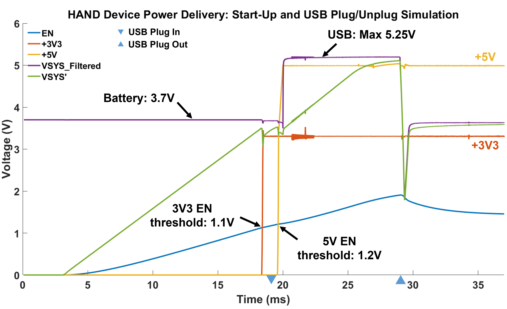
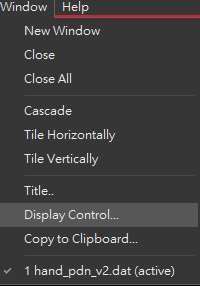
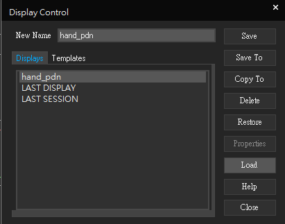
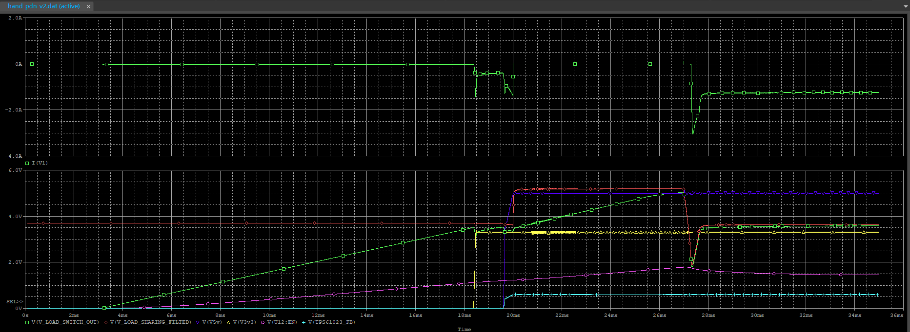
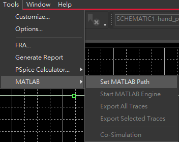
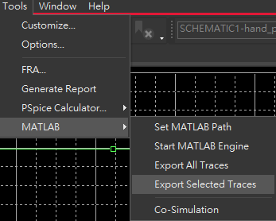
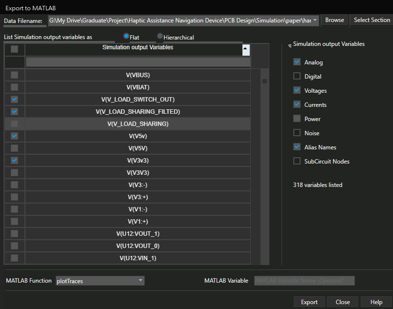
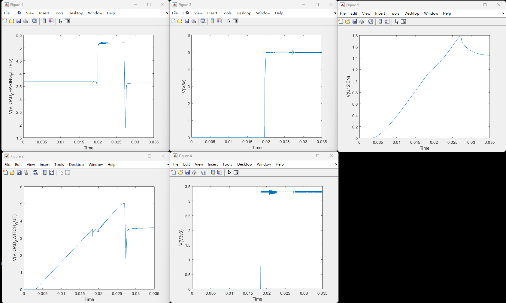
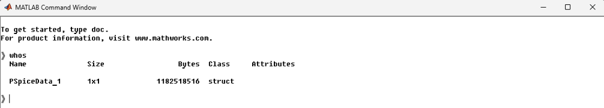

# HAND Simulation

This repository compiles the files and outlines the procedures for verifying the simulation of the HAND Power Delivery Network using ORCAD.

## Software Requirements

- ORCAD ≥ 2022
- MATLAB ≥ 2023a

## Hardware Information

- Intel I9-10900F
- 32 GB RAM
- Data Size $\approx$ 25 GB

The simulation process takes approximately **6** hours.

- Intel I5-12500H
- 24 GB RAM

The simulation process takes approximately **20** hours.

## Results



The above figure demonstrates that under normal operating conditions, the HAND power system consistently outputs 3.3V and 5V.

## Data Visualization

### How to Plot the Results in PSPICE?

After you simulate the circuit, perform the following steps:

1. Window ➞ Display Control

   

2. Choose an existing `hand_pdn` or load `hand_pdn_v2-PSpiceFiles\SCHEMATIC1\hand_pdn_v2\hand_pdn_v2.prb`

   

3. Ensure you're using the correct data file ( `hand_pdn_v2.dat` )
4. View the plotted result

   

## How to Convert .dat to .mat?

### Export

1. Select the MATLAB path

   

2. Export the selected traces

   

3. Choose specific traces (do not export all traces, as it takes an excessively long time) and click export

   

4. (Optional) Generate MATLAB plots

   

### Save as .mat

> [!TIP]
> The following operations are performed in the MATLAB Command Window launched by PSPICE.

1. Open the MATLAB Command Window and run the command `whos`

   

1. Move to the desired directory (by default, MATLAB's working directory may not allow saving)

   ```bash
   cd 'H:\My Drive\Share\HAND\ORCAD\paper'
   ```

1. Save the struct as a .mat file

   ```bash
   save('2025-3-30-hand-sim.mat', 'PSpiceData_1');
   ```

## Complete Folder

This [Google Drive Directory](https://drive.google.com/drive/folders/1SmM2jxRfvN7NogEErioShIMDqE8ifsSX?usp=sharing) contains the simulation results produced by the author. Key files include:

- `hand_pdn_v2.opj`: ORCAD project file
- `third_party`: IC models
- `hand_pdn_v2-PSpiceFiles\SCHEMATIC1\hand_pdn_v2\hand_pdn_v2.dat`: simulation data (ORCAD)
- `hand_pdn_v2-PSpiceFiles\SCHEMATIC1\hand_pdn_v2\hand_pdn_v2.prb`: simulation traces plotting information
- `complete_both_delay.mat` & `2025-3-30-hand-sim.mat`: extracted specific curves converted to `.mat`, which can be plotted using `plot_pspice.m`
- `pdf`: ORCAD schematic diagram pdf file

## Parameters

### PSPICE Simulation Environments

- Analysis

  | name                              | value                   | description                                                         |
  | --------------------------------- | ----------------------- | ------------------------------------------------------------------- |
  | Analysis Type                     | Time Domain (Transient) | Type of simulation (transient time-domain)                          |
  | Run To Time                       | 35m                     | Total simulation duration (`TSTOP`)                                 |
  | Start Saving Data After           | 0.1m                    | Time after which waveform data will be stored                       |
  | Maximum Step Size                 | 2n                      | Maximum time step the solver is allowed to take                     |
  | Skip Initial Transient Bias Point | False                   | Whether to skip DC operating point calculation before transient sim |
  | Run in Resume Mode                | True                    | Whether to resume from a previously saved simulation state          |

- Options ➞ Analog Advanced ➞ General

  | name        | value   | description                                                     |
  | ----------- | ------- | --------------------------------------------------------------- |
  | SPEED_LEVEL | 0       | Solver speed level (0 = default, higher = faster/less accurate) |
  | RELTOL      | 0.005   | Relative tolerance for voltage/current convergence              |
  | VNTOL       | 1e-6    | Voltage error tolerance                                         |
  | ABSTOL      | 1e-9    | Absolute current tolerance                                      |
  | CHGTOL      | 0.01p   | Charge tolerance                                                |
  | GMIN        | 1.0e-12 | Minimum conductance inserted to prevent floating nodes          |
  | ITL1        | 150     | Maximum iterations for DC bias point                            |
  | ITL2        | 20      | Maximum iterations for source stepping                          |
  | ITL4        | 10      | Maximum iterations for transient solver                         |
  | TNOM        | 27.0    | Nominal operating temperature (°C)                              |
  | THREADS     | 0       | Number of threads used in simulation                            |
  | ADVCONV     | True    | Enables advanced convergence algorithm                          |

- Options ➞ Analog Simulation ➞ Auto Converge

  | name         | value   | description                                                     |
  | ------------ | ------- | --------------------------------------------------------------- |
  | AutoConverge | True    | Enables automatic convergence feature                           |
  | ITL1         | 1000    | Maximum iterations for DC bias point calculation (Newton loops) |
  | ITL2         | 1000    | Maximum iterations for source stepping algorithm                |
  | ITL4         | 1000    | Maximum iterations for transient operating point calculation    |
  | RELTOL       | 0.05    | Relative tolerance for convergence                              |
  | ABSTOL       | 1.0e-6  | Absolute tolerance on current                                   |
  | VNTOL        | 0.001   | Voltage error tolerance                                         |
  | PIVTOL       | 1.0e-10 | Pivot tolerance in matrix solver                                |
  | Restart      | True    | Enables restart of simulation in case of convergence failure    |

- Options ➞ Analog Advanced ➞ Bias Point

  | name       | value | description                                          |
  | ---------- | ----- | ---------------------------------------------------- |
  | STEPMIN    | False | Enables minimum step control during bias calculation |
  | GMINSTEPS  | 0     | Number of GMIN stepping steps                        |
  | NOSTEPSRC  | False | Disables source stepping                             |
  | ITL6       | 0     | Maximum iterations for bias point convergence        |
  | NOSTEPDEP  | False | Disables dependent source stepping                   |
  | GMINSRC    | False | Enables GMIN stepping on sources                     |
  | PSEUDOTRAN | False | Enables pseudotransient simulation                   |
  | PTRANSTEP  | 0     | Number of steps for pseudotransient stepping         |

- Options ➞ Analog Advanced ➞ Transient

  | name        | value   | description                                                  |
  | ----------- | ------- | ------------------------------------------------------------ |
  | METHOD      | Default | Numerical integration method (e.g., Gear, Trapezoidal, etc.) |
  | TRTOL       | 7       | Truncation error tolerance (affects adaptive timestep)       |
  | CSHUNT      | Disable | Enables global shunt capacitor                               |
  | TRANCONV    | False   | Enables convergence override for transient                   |
  | IGMOS       | False   | Enables improved MOSFET modeling                             |
  | DEBUG       | 0       | Debug level (0 = off)                                        |
  | DEBUG_START | Disable | Start time for debug data collection                         |
  | DEBUG_END   | Disable | End time for debug data collection                           |

- Options ➞ Gate Level Simulation ➞ Advanced

  | name         | value | description                      |
  | ------------ | ----- | -------------------------------- |
  | DIGDRVF      | 2.0   | Digital driver fall delay        |
  | DIGDRVZ      | 20K   | Digital driver high-Z delay      |
  | DIGOVRDRV    | 3.0   | Digital overdrive factor         |
  | DIGMNTYSCALE | 0.4   | Digital minimum transition scale |
  | DIGTYMXSCALE | 1.6   | Digital maximum transition scale |
  | DIGERDEFAULT | 20.0  | Default digital event resolution |
  | DIGERLIMIT   | 0     | Digital event resolution limit   |

- Data Collection

  | name                           | value                        | description                           |
  | ------------------------------ | ---------------------------- | ------------------------------------- |
  | Voltages                       | All but Internal Subcircuits | Scope of voltage data to be collected |
  | Current                        | All but Internal Subcircuits | Scope of current data to be collected |
  | Power                          | All but Internal Subcircuits | Scope of power data to be collected   |
  | Digital                        | All but Internal Subcircuits | Scope of digital data to be collected |
  | Noise                          | All but Internal Subcircuits | Scope of noise data to be collected   |
  | Probe Data Format              | 64-bit                       | Data resolution (32-bit or 64-bit)    |
  | Save data in CSDF format (CSD) | False                        | Whether to export data in CSDF format |

### Simulation Parameters

| name       | value | description                                                           |
| ---------- | ----- | --------------------------------------------------------------------- |
| VBAT_VALUE | 3.7V  | Battery voltage (constant)                                            |
| VBUS_VALUE | 5.25V | USB voltage (constant)                                                |
| V5V_VALUE  | 5V    | Expected TPS61023 output voltage, used for equivalent resistance calc |
| I5V_VALUE  | 0.6A  | Assumed load current drawn by backend circuit (constant)              |
| V3V3_VALUE | 3.3V  | Expected TPS63806 output voltage, used for equivalent resistance calc |
| I3V3_VALUE | 0.4A  | Assumed load current drawn by backend circuit (constant)              |
| T3         | 20 ms | USB plugin time                                                       |
| T4         | 27 ms | USB unplug time                                                       |

### Library

| relative path                                         | description          |
| ----------------------------------------------------- | -------------------- |
| `.\third_party\titps63805\tps63805_trans.lib`         | Library include file |
| `.\third_party\titps63806\tps63806_trans.lib`         | Library include file |
| `.\third_party\titps61023\library\tps61023_trans.lib` | Library include file |
| `.\third_party\diode\inc\dp2035uvt.lib`               | Library include file |
| `.\third_party\titps22965\tps22965_trans.lib`         | Library include file |
| `.\third_party\murata\ferrite bead\blm18sg700tz1.lib` | Library include file |
| `nom.lib`                                             | Nominal library file |
| `c:\cadence\spb_22.1\tools\PSpice\Library`            | Default library path |
